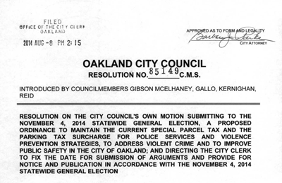

Public safety is a common goal for any community. Yet in Oakland, a diverse city of nearly 500,000 people, public safety inevitably means different things to different people. We believe that appropriate, successful policy can only be developed with accurate, complete information and open, honest discourse.

  

    
    

    <h5 class="card-title"><a class="btn btn-primary" href="{{ '/about-measure-z' | url }}" role="button">About Measure Z</a></h5>
    

  

  

  
      

      <h5 class="card-title"><a class="btn btn-primary" href="{{ '/program-impacts/' | url }}" role="button">Explore Program Impacts</a></h5>
      

    

  

  
      

      <h5 class="card-title"><a class="btn btn-primary" href="{{ '/get-involved' | url }}" role="button">Get Involved in FPS</a></h5>
      

    

_Funding Public Safety_ is a project of [OpenOakland](https://openoakland.org), a volunteer collective that bridges community and technology for a thriving and equitable Oakland. We strive to take a participatory approach to uncovering and answering the questions Oaklanders have about these deeply complex issues. [View the code and contribute on GitHub](https://github.com/openoakland/funding-public-safety).
